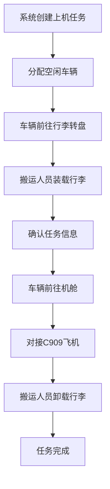
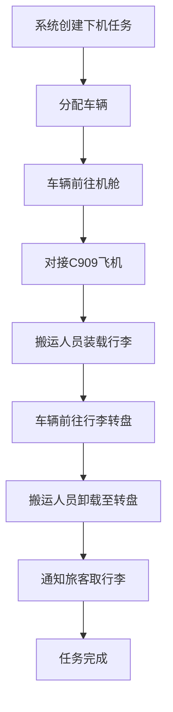

# C909无人行李车运送系统 PRD

## 文档版本信息

| 版本   | 日期         | 作者 | 变更内容   |
| ---- | ---------- | -- | ------ |
| V1.0 | 2026-05-18 | PM | 初始版本创建 |

***

## 一、产品背景与目标

### 1.1 背景

吐鲁番机场拟建设C909无人行李车运送系统，依托5G专频专网与RTK高精度定位，实现行李从机舱到行李转盘的自动化转运，替代传统人工驾驶行李车方式。

### 1.2 目标

- 实现行李运输流程自动化、可视化、可追溯
- 提升行李运输效率，降低人工成本与操作失误
- 保障C909飞机对接过程的安全性

***

## 二、产品范围

本系统包括三大终端模块：

| 模块        | 使用角色   | 核心功能简述                       |
| --------- | ------ | ---------------------------- |
| APP端      | 行李搬运人员 | 航班查看、任务接收、车辆状态监控             |
| 中台电脑端     | 调度管理员  | 车辆管理、任务调度、实时监控               |
| AGV车载控制屏端 | 行李搬运人员 | 手动控制、状态查看、紧急操作（大概率不是触屏，仅作展示） |

***

## 三、用户角色与权限

| 角色                  | 权限描述                |
| ------------------- | ------------------- |
| 行李搬运人员              | 查看航班、接收/完成任务、查看车辆状态 |
| 调度管理员               | 创建/取消任务、车辆调度、系统配置   |
| 机舱对接员(与行李搬运人员是同一个人) | 手动控制AGV对接飞机，执行紧急操作  |

***

## 四、功能需求详情

### 4.1 APP端（行李搬运人员）

#### 4.1.1 首页 - 航班信息列表

- 展示吐鲁番机场当日所有航班信息
- APP端显示字段（精简版）：
  - 基础航班信息：航班号、机型、机号、进/出港、机位
  - 时间信息：计划起飞/到达时间、实际起飞/到达时间
  - 行李相关：旅客人数、行李件数、行李转盘号
  - 状态信息：航班状态、当前节点
- 中台端显示字段（完整版）：
  - 基础航班信息：航班号、航段（三字码）、航司、机型、机号、进/出港、机位、跑道
  - 时间信息：计划起飞/落地、实际起飞/落地、COBT（撤轮档时间）
  - 行李与旅客信息：出港旅客人数、出港行李件数、进港旅客人数、进港行李件数
  - 保障节点：开货舱门时间、关货舱门时间、当前节点（优先展示行李相关节点）
  - 异常与状态：航班状态、异常原因、延误状态、延误原因
- 当飞机达到可上下行李状态时，显示"呼叫行李车"按钮，由人工手动触发行李配送任务（不再由系统自动触发）
- 点击"呼叫行李车"按钮，弹出呼叫弹窗：
  - 根据机型默认推荐行李车数量（默认4辆）
  - 支持手动编辑行李车数量（范围：1-10辆）
  - 确认后创建订单并分配对应数量的行李车任务
- 点击航班进入"订单详情"页面（原"行李配送任务"页面升级为订单层）

#### 4.1.2 任务管理

- 创建配送任务（系统根据航班信息自动创建）
- 任务详情包括：
  - 配送类型（上机/下机）
  - 目标位置（机舱/行李转盘）
  - 行李数量（提前录入系统）
  - 分配车辆ID
- 任务状态流转：
  - 待接单：系统根据航班信息自动创建任务，等待搬运人员接单
  - 已接单：搬运人员选择任务点击接单，任务与该人员绑定，系统分配AGV前往始发地，搬运人员同时前往始发地
  - 已到达始发地：AGV到达始发地，支持手动控制车辆精细对接，手动对接不计入任务流程，仍处于已到达状态
  - 装载中：搬运人员点击软件侧"开始装载"按钮，进入装载状态
  - 配送中：装载完成，AGV前往目的地
  - 已送达目的地：AGV到达目的地，支持手动控制车辆精细对接，需搬运人员点击确认送达，才可释放车辆
  - 已完成：任务完成
- 行李计数功能：装载完成时检测行李数量，若与系统预设总数量不一致，弹窗提醒（不强制限制，仅作提示）

#### 4.1.3 车辆状态监控

实时显示无人车：

- 位置（GIS地图）
- 状态（空闲/运输中/充电/故障）
- 电量、胎压
- 当前任务
- 支持远程指令：
- 鸣笛、开灯、刹车、暂停、继续
- 手动对接控制：到达始发地/目的地后，支持手动控制车辆精细对接，手动对接不计入任务流程，仍处于已到达状态

#### 4.1.4 消息通知

- 车辆到达通知
- 任务状态变更通知
- 异常报警（如电量低、路径受阻）

***

### 4.2 中台电脑端（调度管理员）

#### 4.2.1 大屏监控

- 机场地图可视化
- 显示所有无人车实时位置
- 显示任务路径
- 显示行李转盘、机舱点位

#### 4.2.2 车辆管理

- 车辆列表：
- 车辆ID、状态、电量、累计里程、累计次数
- 车辆控制：
- 前往充电点
- 紧急制动
- 返回停车点

#### 4.2.3 订单与任务调度

- 订单管理：
  - 查看订单列表（包含所有航班订单）
  - 订单详情展示：订单ID、航班号、配送类型、行李车数量、总行李数、订单状态、创建时间
  - 支持手动创建订单（绑定航班、设置行李车数量）
  - 订单取消功能
- 任务调度：
  - 查看订单下的所有任务
  - 任务队列管理（优先级调整、取消、重分配）
  - 历史任务查询与导出
- 中台显示完整字段：航班号、目的地/来源地、计划/实际起飞/到达时间、行李转盘号、机型、登机口、订单状态、任务状态、车辆信息等

#### 4.2.4 系统配置

- 路径规划设置
- 对接安全参数（如对接距离、缓冲阈值）
- 用户权限管理

***

### 4.3 AGV车载控制屏端

#### 4.3.1 首页状态卡片

- 当前任务信息
- 车辆状态（电量、位置、速度）

#### 4.3.2 手动控制面板

- 前进/后退/转弯
- 开灯/鸣笛
- 车门开关
- 急停按钮（物理+虚拟）

#### 4.3.3 对接辅助界面

- 视觉识别画面（货舱门、对接板）
- 激光测距仪实时距离显示
- 对接状态提示（未对接/对接中/已到位）
- 手动微调控制（手柄模拟）

#### 4.3.4 安全提示

- 接近飞机时自动减速提示
- 碰撞预警
- 急停触发后需手动复位

***

## 五、核心业务流程

### 5.1 行李上机流程（起飞前）

### 5.2 行李下机流程（到达后）

